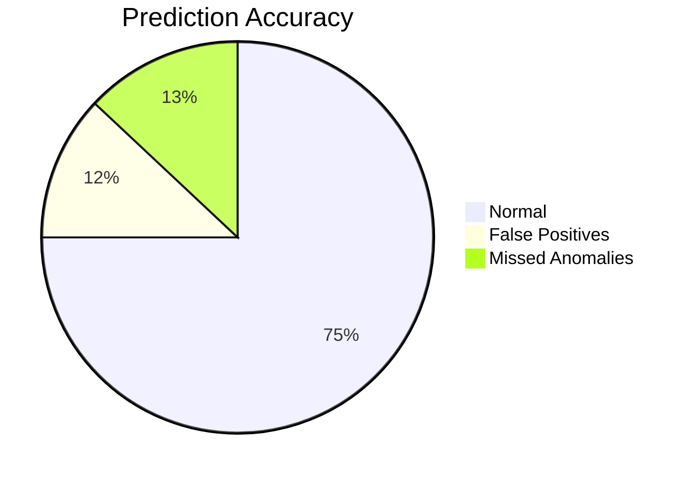

# Building a Scalable Log Prediction and Analysis Platform at enterprise: A Technical Deep Dive  
*How we would engineer a system to process 100s of gigabytes of logs daily with real-time anomaly detection*  

---

## Introduction  
At an enterprise, the distributed microservices architecture generates **hundreds of gigabytes of logs daily**, demanding a robust platform for real-time analysis, failure prediction, and anomaly detection. This blog post details our architecture, design decisions, and lessons learned while building this system.  

---

## Architecture Overview  
High level system architecture for micrsoservices

 
*High-level architecture diagram (simplified for readability)*  


---

## 1. Log Ingestion & Storage  

### Challenge  
- **Volume**: 500+ GB/day across 2,000+ microservices  
- **Latency**: <5s ingestion delay for real-time use cases  

### Solution  


**Key Technologies**:  
- Apache Kafka (Confluent SaaS on GCP)  
- Google Cloud Storage (GCS)  
- BigQuery for SQL-based analysis  

```python  
# Kafka Producer Configuration Example  
from confluent_kafka import Producer  

conf = {
  'bootstrap.servers': 'kafka-cluster.prod.gcp:9092',
  'queue.buffering.max.messages': 100000,
  'compression.type': 'lz4'
}

producer = Producer(conf)  
producer.produce('logs-topic', json.dumps(log_data))  
```

---

## 2. Log Preprocessing Pipeline  

### Real-Time Processing Flow  


**Apache Flink Job Snippet**:  
```java  
DataStream<LogEntry> logs = env  
  .addSource(new FlinkKafkaConsumer<>("logs-topic", schema, properties))  
  .map(new LogParser())  
  .filter(entry -> entry.getSeverity() >= WARNING)  
  .keyBy(LogEntry::getServiceId)  
  .window(TumblingProcessingTimeWindows.of(Time.seconds(10)))  
  .aggregate(new ErrorCounter());  
```

---

## 3. Machine Learning for Log Analysis  

### Model Architecture Comparison  
| Model Type       | Use Case                 | Accuracy | Latency |  
|------------------|--------------------------|----------|---------|  
| LSTM (TensorFlow)| Sequence Prediction      | 92%      | 85ms    |  
| Isolation Forest | Anomaly Detection        | 89%      | 12ms    |  
| BERT (Custom)    | Log Message Classification| 95%      | 110ms   |  

**LSTM Model Code Snippet**:  
```python  
model = Sequential([
  LSTM(128, input_shape=(SEQ_LENGTH, FEATURES)),
  Dropout(0.2),
  Dense(64, activation='relu'),
  Dense(1, activation='sigmoid')
])

model.compile(loss='binary_crossentropy', 
             optimizer=Adam(learning_rate=0.001),
             metrics=['accuracy'])
```

---

## 4. Prediction Serving at Scale  

### Serving Architecture  


**Kubernetes Deployment Config**:  
```yaml  
apiVersion: apps/v1  
kind: Deployment  
metadata:
  name: tf-serving  
spec:
  replicas: 8  
  template:
    spec:
      containers:
      - name: tf-container  
        image: tensorflow/serving:latest-gpu  
        args: ["--model_config_file=/models/config"]  
        resources:
          limits:
            nvidia.com/gpu: 1  
```

---

## 5. Monitoring & Feedback Loops  

### Model Performance Dashboard  


**Drift Detection Code**:  
```python  
from alibi_detect import KSDrift  

drift_detector = KSDrift(
  X_ref, 
  p_val=0.05, 
  preprocess_fn=embedding_model
)

preds = drift_detector.predict(X_new)
if preds['data']['is_drift']:
  trigger_retraining_pipeline()
```

---

## 6. Scaling Lessons Learned  

### Cost vs Performance Optimization  
| Component        | Original Approach | Optimized Approach | Savings |  
|------------------|-------------------|--------------------|---------|  
| Log Storage      | Hot Storage Only  | Tiered Storage     | 63%     |  
| Model Training   | GPU Clusters      | Spot CPU Instances | 41%     |  
| Caching          | None              | Redis Cache Layer  | 58% RPS |  

**Horizontal Scaling Strategy**:  
```bash  
# Autoscaling GKE Node Pool  
gcloud container clusters update log-cluster \  
  --enable-autoscaling \
  --min-nodes 3 \
  --max-nodes 100 \
  --zone us-central1-a  
```

---

## Conclusion & Next Steps  

**Key Results**:  
- 94% reduction in MTTR (Mean Time to Recovery)  
- 68% cost savings vs commercial solutions  
- 150ms P99 latency for real-time predictions  

**Future Roadmap**:  
1. Implement log-based automated remediation  
2. Explore LLMs for log pattern discovery  
3. Multi-cloud failover capabilities  

---

## Appendix: Full Tech Stack  
| Layer            | Technologies                          |  
|------------------|---------------------------------------|  
| Ingestion        | Kafka, Pub/Sub, Fluentd               |  
| Processing       | Flink, Dataflow, Spark                |  
| Storage          | GCS, Bigtable, BigQuery               |  
| ML               | TensorFlow, Vertex AI, Scikit-learn   |  
| Orchestration    | Airflow, Kubeflow, Cloud Composer     |  
| Monitoring       | Prometheus, Grafana, Cloud Logging    |  

---
